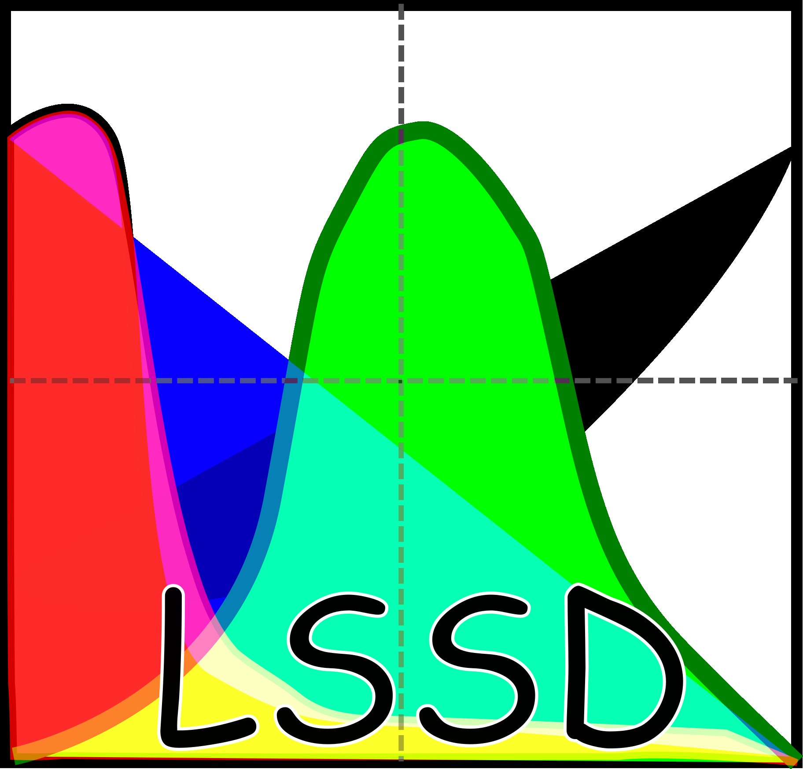

# LSSD: Luminescence Sensitivity Statistics and Data


A scientific and open Python package for data analysis in luminescence sediment provenance. 
This is a initial version (0.1.1) builded to improve the data analysis of my roomate PhD.
Current version supports integration with another scientific packages (e.g. Scipy).

This code is built with Matplotlib, Pandas and Numpy.


# Basic usage
LumiData is the main object of this module. This object stores the ```.binx``` tabular data and the signal readings. The tabular data is stored as Pandas Dataframe and can be called by "maindataframe". Signal data is stored as a dictionary which the key is the "id" column of the process. Each register has two list inside a list: ```[[time/temperature],[counts]]```.
 
## Basic examples
Import and integrating signal:

```python
import lssd as ld #import
path = 'my_binx_file/file.binx'
data = ld.LumiData(path)
data.integrate_OSL([1,2],dt=0.1) #integrate OSL signale between 1 and 2 seconds, with dt=0.1s
```

Seeing the tabular data:
```python
print(data.maindataframe) #shows the tabular data
print(data.maindaframe.loc[:,['id','integral_OSL']]) #shows the column ID and the integral of the signal
id_plot = 1
data.plot(id_plot) #plot the signal which id=1
```


For my examples, look to examples directory.

# Help or suggestions?
You are encouraged to test my code and also send an e-mail with suggestions or questions! I'm also available to help you with your data analysis.

Please, reference to Bueno and Sawakuchi (2025).

Bueno, João P. S; Sawakuchi, André O.; (2025) Library for Luminescence Sensitivity Statistics and Data (LSSD)
A Python package for data analysis in luminescence sediment provenance. In: New World Luminescence Dating Workshop, São Paulo, Brazil.

# Licence
[](LICENSE)

This project is under MIT License.

